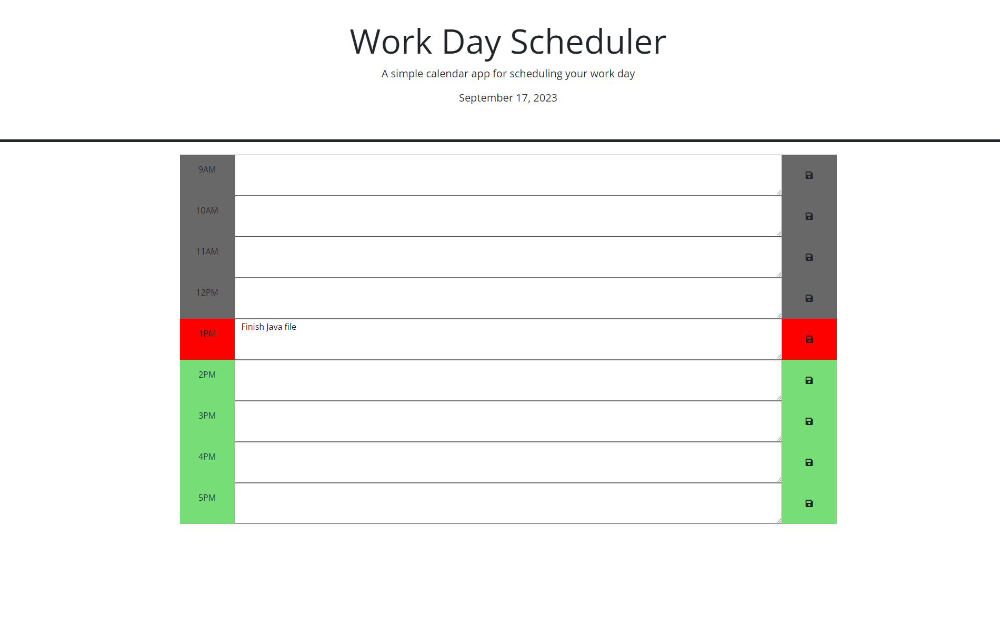

# 05 Third-Party APIs: Work Day Scheduler

## Description

I completed this task as part of the 05 challenge for Third-Party APIs. This site will show the current date and have an input box for each hour from 9AM to 5PM. The website will work as a work day scheduler so you can input any task and save it to local storage with the click of a button. Also the website will be updated with your current time and the hours will show as grey if the hour is past your current hour, red if the hour is equal to your current hour, and green if the hour is in the future of your current hour. Coding this project helped me get used to jQuery, dayJS, and other 3rd-party API's.

## Installation

No need to install just run in browser. Link to deployed APP : https://n8hoang.github.io/05-challenge/Develop/

## Usage

Type in any hour and click the save button to save to local storage. Past will be grey, current will be red, future will be green.

## Credits

Coded by github.com/n8hoang

## License

MIT License

Copyright (c) [2023] [Nathan Hoang]

Permission is hereby granted, free of charge, to any person obtaining a copy
of this software and associated documentation files (the "Software"), to deal
in the Software without restriction, including without limitation the rights
to use, copy, modify, merge, publish, distribute, sublicense, and/or sell
copies of the Software, and to permit persons to whom the Software is
furnished to do so, subject to the following conditions:

The above copyright notice and this permission notice shall be included in all
copies or substantial portions of the Software.

THE SOFTWARE IS PROVIDED "AS IS", WITHOUT WARRANTY OF ANY KIND, EXPRESS OR
IMPLIED, INCLUDING BUT NOT LIMITED TO THE WARRANTIES OF MERCHANTABILITY,
FITNESS FOR A PARTICULAR PURPOSE AND NONINFRINGEMENT. IN NO EVENT SHALL THE
AUTHORS OR COPYRIGHT HOLDERS BE LIABLE FOR ANY CLAIM, DAMAGES OR OTHER
LIABILITY, WHETHER IN AN ACTION OF CONTRACT, TORT OR OTHERWISE, ARISING FROM,
OUT OF OR IN CONNECTION WITH THE SOFTWARE OR THE USE OR OTHER DEALINGS IN THE
SOFTWARE.
